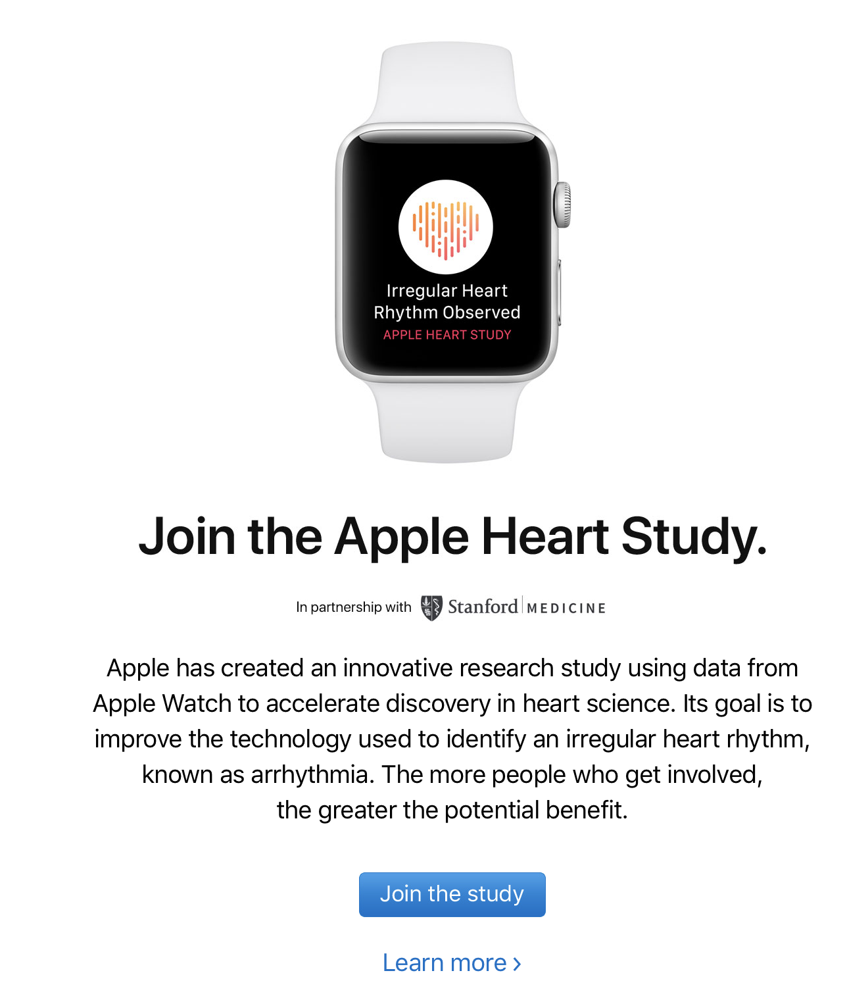

# Apple Watch

[Image Source](https://store.storeimages.cdn-apple.com/4974/as-images.apple.com/is/image/AppleInc/aos/published/images/4/2/42/alu/42-alu-silver-sport-white-s1-grid?wid=270&hei=275&fmt=jpeg&qlt=95&op_usm=0.5,0.5&.v=1512435128675)

## Data Tracked
This blog entry is going to be from my own perspective and on my own personal experience using my Apple Watch Series 2. My iPhone already tracks a lot of my data and stores it in the health app (see (my blog post on Apple’s Health app)[AppleHealthApp.md]). There are, however, several pieces of data that I am now capable of tracking as a result of getting a companion Apple Watch to go along with my iPhone, the most prominent one being my heart rate.

[Image Source](https://cdn.arstechnica.net/wp-content/uploads/2015/05/DSC00601.jpg)

Above, you can see a picture of the green lights that turn on when Apple Watch is monitoring your heart rate. Your blood in your wrist absorbs and reflects different amounts of green light depending on your heart rate, which is what allows the Apple Watch to make the measurements it makes. This is only one of the different data points the Apple Watch measures on a daily basis.
Another piece of data the Apple Watch tracks is your movement. It detents when you are sitting, standing, walking, running, or doing some other form of exercise. All of these data points are combined in special ways that allow for the representation of knowledge in several different ways.

## Knowledge Provided
One of the most iconic visuals that goes along with the apple watch is the three rings (shown in the image at the top of this blog post): stand (blue), exercise (green), and move (red). The stand ring is just what it sounds like. It gives you a binary value at each hour of the day telling you whether or not you stood during that hour. It determines how much standing you did throughout the day by counting up the number of the hours that it detected you standing. Next is the exercise goal. This is also purely movement based. This ring represents the number of minutes you spent exercising on a given day. Finally, there is the move ring, the most complex of the three rings. It uses a combination of movement and heart rate data as well as your personal data provided of your gender, age, height, weight, etc. in order to calculate how many calories you've burned in a given day.
For each of these rings, you can set daily goals. If you reach your goal in a given ring, it completely fills up and notifies you that you are living a healthy lifestyle. On days you get really close to closing a ring, your Apple Watch notifies you that you only need to stand or exercise or move a little more in order to close it. Finally, it also allows you to connect to your friends through the companion “Activity” app on your iPhone so that you and your friends can encourage each other along the way.
There are several other pieces of data the Apple Watch tracks that you can view through the iPhone Health app, but [I wrote another blog post on that](AppleHealthApp.md).

## Limitations
The biggest and most obvious limitation of the Apple Watch is that it requires a companion iPhone in order to function. Therefore only Apple customers can take advantage of its full… or really ANY functionality. Finally, there are multiple version of the Apple Watch, some of which have different functionality. For example, the Apple Watch series 1 does not have a GPS built in, while the Apple Watch series 2 and on do have a GPS built in.

## Ethical Concerns
Apple is known for protecting their users data very well, so users should not be concerned about Apple selling their Apple Watch data to, for example, insurance companies to see how healthy people are before selling them insurance. All of your data as an Apple Watch user is just as secure as the rest of your Apple Id account. I would even go to the other end of the spectrum and say Apple is being very ethical with their Apple Watch users. Not only are they encouraging people to live healthier lives through this technology, but they explicitly ask to use the user's data for certain things. Recently I got an email asking me if I wanted to participate in a study to health further research in heart science (image of the email is below).

 Overall, I would say there are little to no ethical concerns in the Apple Watch.
