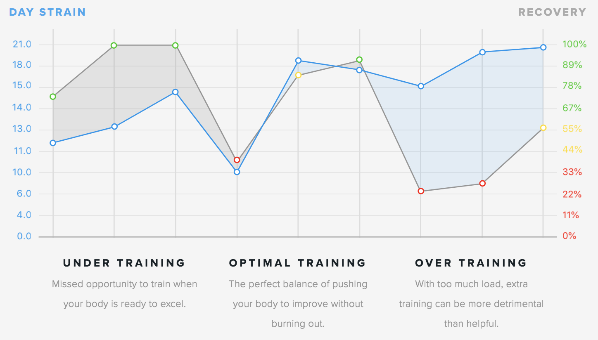

# WHOOP Wearable

NOTE: Arguably, this device could have been put in the “Smartphones and Wearable Devices” category, but since it is much more heavily marketed towards athletes, I thought it was a better fit for the “Sports Devices” section.

[Image Source](https://vandrico.com/wearables/sites/default/files/styles/large/public/WHOOP.jpg?itok=oQHct7E9)

## Data Tracked
Right away on the WHOOP website, it claims that the wearable device “collects 5 metrics 100x/second 24 hours/day, 7 days/week to provide the most accurate and granular understanding (knowledge) of your body”. Similar to the [Fitbit](Fitbit.md) and [Apple Watch](AppleWatch.md), the WHOOP tracks both your heart rate as well as physical activity throughout your daily life in order to create knowledge about your body and your health. And boy does it provide a lot of knowledge.

## Knowledge Provided

[Image Source](https://www.xconomy.com/wordpress/wp-content/images/2015/09/Whoop-1100x733.jpg)

The categories of knowledge that WHOOP data is sorted into are: sleep, recovery, and exercise. The partner mobile or web app provides various information and knowledge that helps the user optimize their athletic life. 

First, the app provides a circular gauge giving you a indication of how strained your body is. This is more or less a measurement of physical exertion to allow you to know how far you can push your body in order to optimize your exercise.

The WHOOP also provides knowledge of recovery, indicating a circular gauge and percentage telling the user how close they are to being fully recovered. This gauge is colored differently depending on how close you are to being recovered. If the color is a high percentage and colored green, it means “All systems go. Your body is primed for peak performance.” If the color is yellow and a medium percentage, it means “Proceed with caution. Your body will respond to training but it is not peaking.” Finally, if the color is red, it means “Take it easy. Your body needs more time to recover or you might risk injury.”

Lastly, the WHOOP gives you knowledge about your sleep patterns. Unlike the [Fitbit companion application](Fitbit.md), the WHOOP not only tells you how many hours you slept during the night, but it also provides a target amount of sleep for you to have in order to be in peak condition. It even goes the extra step to calculate the percentage of the desired sleep that you got in order to give you an understanding of how close you were to achieving your goal.
The WHOOP uses all of this knowledge together to create even more knowledge. Below is an example of a chart that is provided that tells you how much you are straining your body in relation to how much you are recovering. In this case, you want to keep the recovery line above the strain line so as not to hurt yourself while simultaneously keeping it as close as possible to make sure you are exercising as much as possible.

[Image Source](https://www.whoop.com/experience/#analytics)

## Limitations
The biggest limitation I could find about the Whoop wearable is that you have to wear it in order to have it track your data, which isn’t too much of a drawback. One drawback is the pricing though. Rather than paying a flat fee for the product, it is a subscription of $30/month with a minimum of 6-months to begin. That’s 180 dollars right off the bat just to get started. If this device were a flat fee and much less expensive, I would probably get one myself. 

## Ethical Concerns
While WHOOP as a company does not sell the data of their users, I actually ran across [an article about NFL players who sell the data tracked by their WHOOP wearable](https://www.engadget.com/2017/04/25/nfl-whoop-players-sell-health-data/). This is a really cool way for athletes to monetize their workouts, something that, before this point, I have never heard of before. In the end, I haven’t discovered any ethical concerns regarding the WHOOP device.
